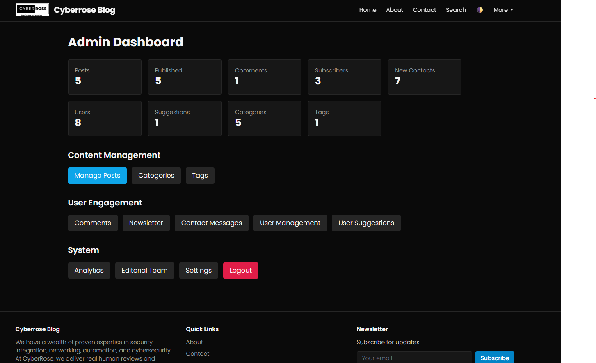

# CyberBlog — An Integrated Blog + Management System

A lightweight PHP blog and management system with a clean dark UI and an installer wizard that guides you through configuration, database setup, and admin creation.

> If the image above does not load on GitHub, add your screenshot file at `assets/images/admin-dashboard.png` and commit it.

## Features
- Tailwind-styled blog UI with dark/grey mode toggle
- Admin dashboard, posts, categories, tags, comments, newsletter
- Google OAuth for public actions (optional)
- Guided Setup Wizard: environment checks, config writer, schema init, admin creation

## Admin Dashboard Overview

See `features.txt` for a detailed tour. Highlights include:

### Content Management
- Manage Posts — create, edit, publish, delete
- Categories — organize post categories
- Tags — tag management for SEO and grouping

### User Engagement
- Comments — moderate user feedback
- Newsletter — manage subscribers
- Contact Messages — view form submissions
- User Management — manage registered users
- User Suggestions — track ideas and feature requests

### System Tools
- Analytics — traffic and performance (extensible)
- Editorial Team — manage authors/editors
- Settings — site preferences and integrations
- Logout — secure session termination

### Dashboard Summary Widgets
- Posts / Published counts
- Comments pending/total
- Subscribers
- New contacts
- Users
- Suggestions
- Categories & Tags

## Requirements
- PHP 7.4+ (PHP 8.1/8.2 recommended)
- MySQL/MariaDB
- Extensions: `mysqli`, `json`, `mbstring`, `openssl`

## First-Time Setup (Local)
1. Start a PHP server from the project root:
   - Windows/XAMPP: point Apache to this folder or run `php -S localhost:8000 -t .`
2. Open `http://localhost:8000/setup/index.php`
3. Follow the steps to:
   - Verify environment
   - Enter site name, base URL, and DB credentials
   - Initialize the database
   - Create an admin user
4. Log in at `/admin/login.php`

## cPanel Deployment
1. Upload `cyberblogv1.0.zip` to your cPanel `public_html` (or a subfolder like `public_html/blog`).
2. Extract the ZIP.
3. Ensure `.htaccess` is present in the root of the extracted folder.
   - Pretty URLs: `post/<slug>`, `category/<slug>`, `sitemap.xml`
   - Directory index: `public/index.php`
   - PHP version is set to ea-php81 or compatible (adjust via cPanel if needed).
4. Visit `/setup/index.php` on your domain to run the installer.
   - Set `Base URL` appropriately if deployed in a subfolder (e.g., `/blog`).
5. After setup completes, visit:
   - Blog home: `/public/index.php`
   - Admin login: `/admin/login.php`

## Configuration
- Installer writes `config.php` with site, DB, security, and optional Google OAuth settings.
- To change later, update `config.php` or re-run parts of the setup (DB changes require manual updates).

### Database Initialization Overrides
- Initialize: creates tables if missing (idempotent)
- Wipe and reinitialize: drops existing `cms_*` tables, then recreates from `setup/schema.sql` (destructive)
- Use existing database: skips schema changes

## Security Notes
- Do not commit secrets to GitHub. `config.php` generated by installer contains credentials.
- Use secure passwords for the admin user.
- If enabling Google OAuth, set correct `redirect_uri` like `https://yourdomain/comments/google_callback.php`.

## Development
- Styles are in `assets/css/styles.css`; JS helpers in `assets/js/main.js`.
- Admin pages live under `admin/`; public pages under `public/`.

## License
Proprietary unless otherwise specified by the repository owner.